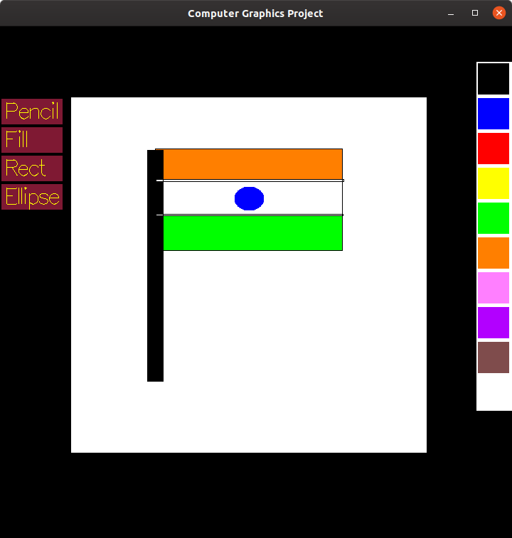

Results, Issues and Analysis
>Made By:

1. Debmeet Banerjee     2018A7PS0385H
2. Anirudh Sood         2018A7PS0673H
3. Sri Chand Gamguri    2017A7PS0272H

---
>Procedure:

To make this Project, I used the freeGLUT library: http://freeglut.sourceforge.net/, which I also used in Assignment 1. I worked on the Ubuntu terminal and used the gedit text editor. The program is a very simplified clone of the Microsoft Paint application. Here a user has access to the pencil tool, rectangle tool, ellipse tool, and fill tool along with 10 different colour options. The working of fill tool is the real goal of this project as it helps in implementing the Research Paper by Henry Lieberman - "How to Color in a Coloring Book".

---

>Issues Faced While Doing the Assignment

1. Working with Mouse Input

    It was not difficult but I had to go thorough some websites and youtube videos to understand the working. The most difficult part was mouse picking that, that is, getting information to the system where the user clicks the mouse.
2. Confusion between Various Libraries Available

    There were many libraries like GLUT, GLEW, GLFW3, SDL2 which work with OpenGL and achieve similar effects(with some unique features as well)
3. Random Segmentation Faults

    It was really difficult to remove random segmentation faults occuring in the program. After a little debugging, most of the problems stopped happening but some random segmentation faults still occur.

4. Using Vectors

    I was not comfortable in using vectors in C++.

5. Buffer, Double/Single Buffered etc confusion

    While working I had to understand the OpenGL list functionality. I had confusions between scene that was single buffer bit or double buffer bit. Lastly, I also had confusion between glFlush and swapBuffers. Thankfully, now I understand all of it.

6. Dealing with Callbacks in C++

7. Leakage of Colour in other Areas while using the Colour Fill Algorithm

8. Pencil tool not stopping to draw even after mouse has been released.
---

>Other Places from where I took Help:

1. https://nehe.gamedev.net/
2. http://www.opengl-tutorial.org/
3. https://learnopengl.com/
4. Some YouTube videos
5. https://stackoverflow.com/questions/2298242/callback-functions-in-c
6. http://enchantia.com/graphapp/doc/tech/ellipses.html

---

>Compiling and Running

First of all you need to install GLUT:

In the linux terminal run the following command:

    sudo apt-get install freeglut3-dev

Compiling the Project is very easy. Go to the Directory where the main.cpp file is located. Open a Terminal in there. Enter the following command-

    g++ main.cpp -lglut -lGL -lGLU -lm
After this , a file called a.out will appear in the same directory.
Now run the project using:

    ./a.out

After this, a Window will open in which the project will run. Now you can use the mouse and left click on various tools and colours to draw the desired shapes.

Sample Output:

---

>About The Algorithm:

Here is the Basic Algorithm, for simple shapes:

1. A point is chosen in the interior of a figure.

2. A point is considered interior if its colour is same as the point chosen in step 1.

3. When a colour change is noticed, it means that the point is a boundary point.

4. Scan for the boundary should be made horizontally if possible(Because they occupy a single word).

5. So from the interior point, scan left till the boundary.

6. Then scan right till the boundary.

7. Now that whole row of points is interior and hence should be coloured.

8. Now from the row in step 7, we need to go vertically, above and below, so whole figure will be completed.

9. This Algorithm struggles in <strong>concave</strong> shapes.

10. This Algorithm gets stuck if there is a hole in the figure(only if patterns are used, no problem with solid colours).

Improvements:

1. After a line is shaded, we need to examine all interior points adjacent to that line.

2. U-turn: New interior points on the old line should start another vertical scan going in the opposite direction from the scan that discovered them.

3. S-turn: New interior points on the old line should start another vertical scan going along the direction of the scan that discovered them.

4. Imaginary Boundary points are placed on the places which are currently stored to be shaded later on the agenda list.

---
Overall it was a good learning experience!

Hope you Like our Project and make really good artwork from it!!
